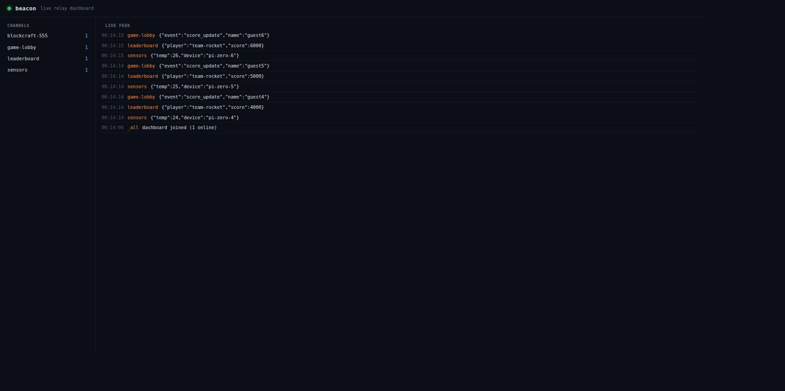

# beacon

<p align="center">
  
  
  
  
</p>

**One command turns any laptop into a real-time pub/sub relay** — with a
live dashboard and, if you want, a public URL. No websocket library, no
build step, no account to sign up for.

```bash
pip install -e .          # or: pip install beacon-relay, once published
beacon serve
```

```
beacon relay listening on http://localhost:8420
  dashboard : http://localhost:8420/
  publish   : POST http://localhost:8420/pub/<channel>   (JSON body)
  subscribe : GET  http://localhost:8420/sub/<channel>   (Server-Sent Events)
```

Open `http://localhost:8420/` and you'll see every channel and every message
flowing through the relay, live, as it happens:



## Why

Every hackathon project that needs two devices to talk to each other in
real time ends up hand-rolling the same plumbing: a websocket server, a
message format, reconnect logic, a way to see it's actually working. That's
an hour you don't have, spent before you've built anything a judge cares
about.

`beacon` is that hour, already spent. Point every device at one relay and
you get:

- **pub/sub over plain HTTP** — publish is a `POST`, subscribe is a `GET`
  that streams [Server-Sent Events](https://developer.mozilla.org/en-US/docs/Web/API/Server-sent_events).
  Every browser, phone, microcontroller, and `curl` already speaks this —
  no client library to install.
- **a live dashboard** — every channel, every message, every join/leave,
  visible the moment it happens. Great for judges: point at the screen and
  say "look, it's live."
- **presence for free** — subscribers can pass `?name=you`, and everyone
  else on the channel sees you join and leave.
- **one flag for a public URL** — `beacon serve --tunnel` shells out to a
  [cloudflared quick tunnel](https://developers.cloudflare.com/cloudflare-one/connections/connect-networks/do-more-with-tunnels/trycloudflare/)
  and prints a `*.trycloudflare.com` URL. No DNS, no account, no config —
  point two phones at it from across the room.
- **zero dependencies** — pure Python standard library. Works on a
  conference laptop with no internet (besides `--tunnel`, which needs
  `cloudflared` on your `PATH`).

This is the realtime half of what [`hoist`](https://github.com/nikhilcherry/hoist)
does for static apps: `hoist` gets a whole app onto a public URL; `beacon`
gets many devices talking to each other in real time, in about the same
amount of typing.

## See it work

`examples/multiplayer_cursors.html` is a ~40-line page with no build step:
open it in a few browser tabs (or hand it to a few phones), move your
mouse, and every other tab's cursor follows live. This is three real tabs,
each running the unmodified example, talking only through `beacon serve`:


There's no signaling server, no room-joining handshake, no WebRTC — every
tab just publishes its mouse position to a shared channel and subscribes
to everyone else's. That's the whole trick beacon exists to make trivial.

## How it works

```
   POST /pub/<channel>  ──┐
   (any publisher)        │
                           ▼
                    ┌─────────────┐        one Queue per open
                    │     Bus     │   ───▶ subscriber connection
                    │ (in-memory) │
                    └─────────────┘
                           │
   GET /sub/<channel>  ◀──┘
   (Server-Sent Events, stays open)
```

- A channel is created the moment someone subscribes to it and forgotten
  the moment the last subscriber disconnects — there's no channel registry
  to configure, no persistence, no message history. Beacon relays what's
  happening *right now*; it's a relay, not a queue.
- Every subscriber connection gets its own `Queue`; a publish fans a copy
  of the event out to every queue on that channel (plus the dashboard's
  firehose subscription at `/sub/_all`) and returns immediately.
- The HTTP server is a plain `ThreadingHTTPServer` from the standard
  library — one thread per open connection, no async framework, no
  external event loop to reason about.
- Presence (`?name=you`, join/leave events) is just bookkeeping on top of
  the same subscribe connection — when it closes (tab closed, network
  drop), the server notices and broadcasts a `leave`.

## Use it for

- **multiplayer state** — every player publishes to a shared channel,
  everyone else subscribes. See `examples/multiplayer_cursors.html` above.
- **IoT / sensor swarms** — an ESP32, a Raspberry Pi, a phone's
  accelerometer, all `POST`ing to `/pub/sensors`; one dashboard watching
  all of them.
- **live leaderboards / scoreboards** — publish a score update, every
  connected screen updates instantly.
- **cross-device control** — a phone as a remote for a laptop app, a QR
  code that opens a controller page that publishes button presses.
- **judge-visible "it's alive" proof** — the dashboard alone is often worth
  running just so judges can see live traffic during a demo.

**Built on beacon:** BlockCraft, a single-file WebGL voxel game, uses it to
add live multiplayer presence — two browser tabs opened with the same
world seed join the same beacon channel, each player publishes their
position every tick, and everyone renders everyone else's avatar in real
time. The entire multiplayer layer is under 150 lines on top of `fetch` +
`EventSource`; no game server was written. (Not included in this repo —
same idea as `examples/multiplayer_cursors.html` above, just in 3D.)

## API

| Method | Path              | Does                                                    |
|--------|-------------------|----------------------------------------------------------|
| `POST` | `/pub/<channel>`  | Publish a JSON body to `<channel>`                        |
| `GET`  | `/sub/<channel>`  | Subscribe via Server-Sent Events (add `?name=you` for presence) |
| `GET`  | `/sub/_all`       | Firehose: every event on every channel (what the dashboard uses) |
| `GET`  | `/channels`       | JSON snapshot of active channels and their subscribers    |
| `GET`  | `/health`         | Liveness check                                            |
| `GET`  | `/`               | The live dashboard                                        |

### From the browser

```js
// publish
fetch("http://localhost:8420/pub/sensors", {
  method: "POST",
  body: JSON.stringify({ temp: 21.4 }),
});

// subscribe
const source = new EventSource("http://localhost:8420/sub/sensors?name=laptop");
source.onmessage = (e) => console.log(JSON.parse(e.data));
```

### From Python

```python
from beacon.client import BeaconClient

c = BeaconClient("http://localhost:8420", "sensors")
c.publish({"temp": 21.4})

for event in c.subscribe(name="pi-zero"):
    print(event)
```

### From the command line

```bash
beacon pub sensors '{"temp": 21.4}'
beacon sub sensors
```

## Going public

Two ways to get beacon onto a public URL, for two different situations:

```bash
beacon serve --tunnel
```

```
  public    : https://random-words-here.trycloudflare.com  <-- share this
```

A [cloudflared quick tunnel](https://developers.cloudflare.com/cloudflare-one/connections/connect-networks/do-more-with-tunnels/trycloudflare/) —
works from any device, anywhere, needs nothing configured ahead of time.
It's ephemeral: the URL is random and dies the moment `beacon` stops. Good
for a one-off demo.

If you have [`hoist`](https://github.com/nikhilcherry/hoist) set up with
your own domain, use `--hoist` instead:

```bash
beacon serve --hoist          # or: beacon serve --hoist my-relay-name
```

```
  https://beacon.yourdomain.com
```

This calls `hoist adopt` under the hood, registering the already-running
relay port under your persistent Cloudflare Tunnel + DNS. The URL is
stable across restarts — the same address every time — which is what you
want for a QR code left up on a table for an entire hackathon, or a
webhook target teammates can bookmark, rather than a link that changes
every run. `--tunnel` and `--hoist` are mutually exclusive; pick whichever
matches whether this demo needs to outlive the moment.

## Development

```bash
python3 -m venv .venv && source .venv/bin/activate
pip install -e .[dev]
pytest tests/ -v
```

## License

MIT
